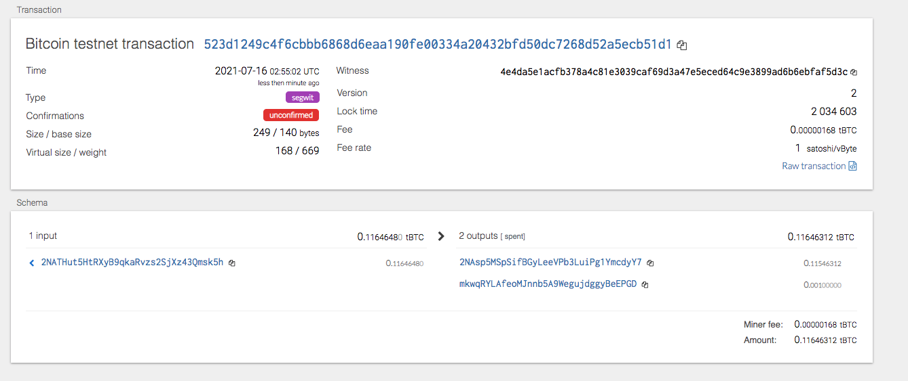

# Blockchain with python
For this project I created a wallet using python to send Bitcoin transacations.  The wallet was created using the derive blockchain tools to create a private key that was then ran through my terminal.  I created transaction parameters to send and create transactions.  Using the terminal I was able to send a transaction on a Bitcoin Testnet.

